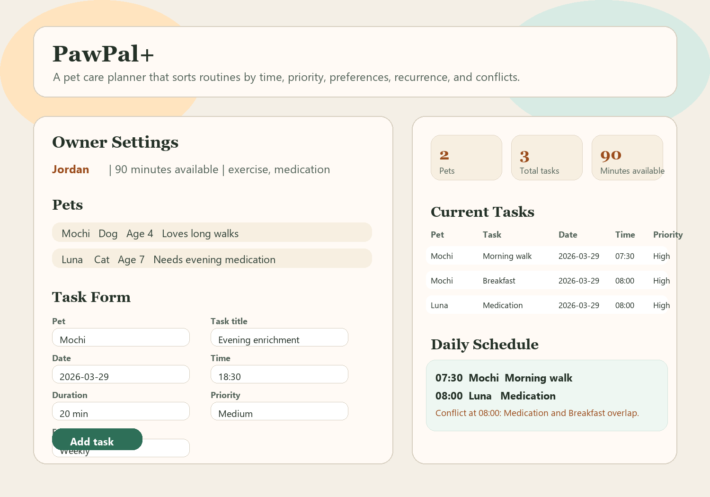
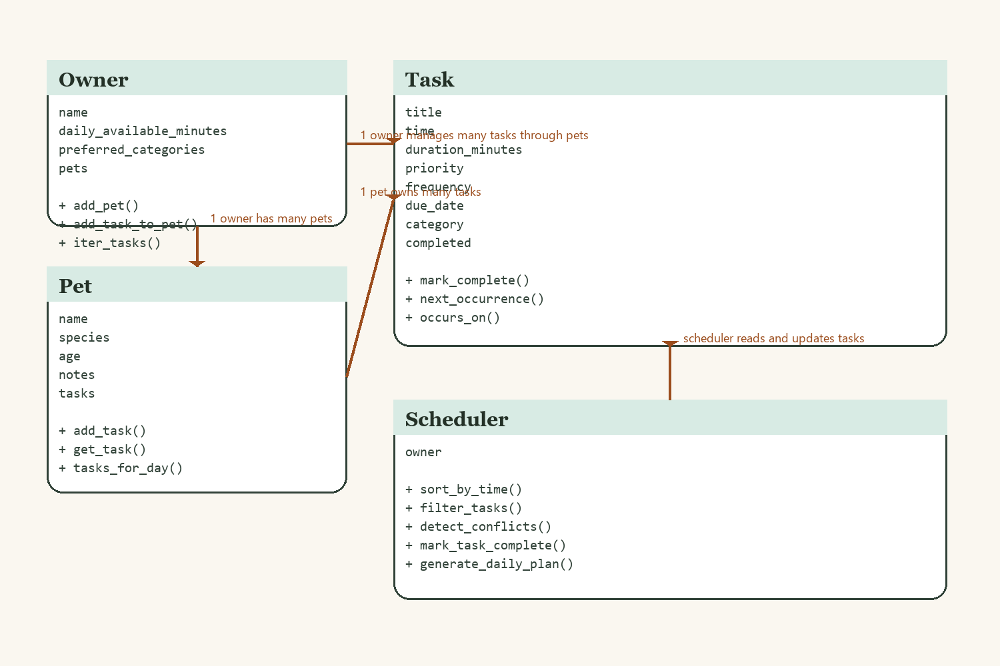

# PawPal+ (Module 2 Project)

**PawPal+** is a Streamlit pet care planner that helps an owner manage multiple pets, organize care tasks, and generate a realistic daily schedule based on time limits, priorities, recurring routines, and owner preferences.

## Features

- Track an `Owner`, multiple `Pet` profiles, and detailed `Task` objects.
- Add tasks with a date, time, duration, priority, frequency, category, and notes.
- Generate a daily plan that explains why each task was selected.
- Sort tasks chronologically and filter them by pet or completion status.
- Detect exact-time conflicts and surface warnings instead of failing silently.
- Automatically create the next daily or weekly task when a recurring task is completed.
- Demo the backend in the terminal with `main.py`.
- Interact with the full system through the Streamlit UI in `app.py`.

## Smarter Scheduling

The scheduler uses a simple but explainable scoring strategy:

- `high`, `medium`, and `low` priorities are weighted differently.
- Preferred categories receive a bonus when the owner marks them as important.
- Recurring tasks receive a small boost so routine care stays on track.
- The final plan still displays tasks in time order for readability.
- If the owner runs out of available minutes, the app reports which tasks were skipped.

## UI Demo



## System Architecture

Final UML diagram:



Mermaid source is included in [`assets/uml_final.mmd`](assets/uml_final.mmd).

## Project Structure

- `pawpal_system.py`: backend classes and scheduling logic
- `app.py`: Streamlit interface and session-state integration
- `main.py`: CLI demo script
- `tests/test_pawpal.py`: automated test suite
- `reflection.md`: project reflection

## Getting Started

### Setup

```bash
python -m venv .venv
.venv\Scripts\activate
pip install -r requirements.txt
```

### Run the Streamlit App

```bash
streamlit run app.py
```

### Run the CLI Demo

```bash
python main.py
```

## Testing PawPal+

Run the automated tests with:

```bash
python -m pytest
```

The current test suite verifies:

- marking a task complete
- adding tasks to a pet
- chronological sorting
- daily recurrence creation
- conflict detection for duplicate times

**Confidence Level:** 4/5 stars. The core scheduler behaviors are covered and passing, but overlap-based conflict detection and more advanced rescheduling logic would be the next areas to deepen.
